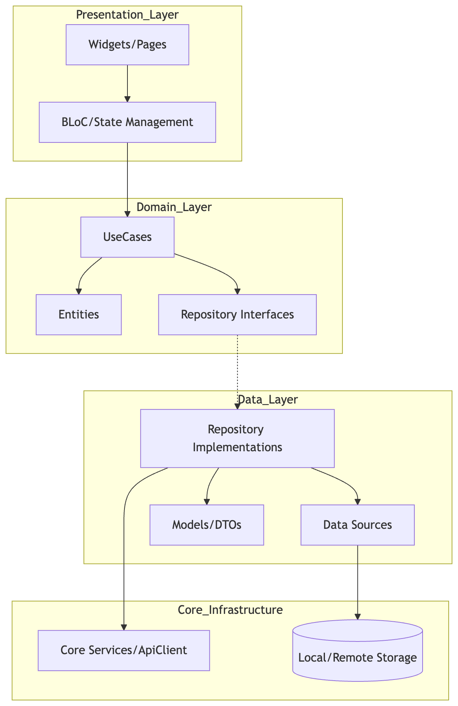

# GeoSnap: Smart Attendance & Advanced Media Sync

GeoSnap is a high-performance Flutter application designed for location-aware attendance tracking and resilient media synchronization. Built with a focus on precision and architectural excellence, it demonstrates advanced device hardware integration and robust state management.

## 🏗️ Detailed Project Architecture

GeoSnap is engineered with a **Feature-Driven Clean Architecture** combined with **Functional Programming** patterns. This hybrid approach ensures strict separation of concerns, high testability, and resilient error handling.

### 🏛️ Architectural Philosophy

The application follows the dependency rule: **Inner layers must not know anything about outer layers.**

1.  **Feature-Driven**: Code is organized by business features (`attendance`, `snap`) rather than technical layers. This improves discoverability and limits the blast radius of changes.
2.  **Clean Architecture**: Separation into Domain, Data, and Presentation layers to decouple business logic from external frameworks.
3.  **Functional Error Handling**: Leveraging `fpdart` to replace exceptions with explicit `TaskEither<Failure, T>` types, making error states first-class citizens in the codebase.

### 📊 Dependency Flow & Data Cycle



### 🧱 Layered Breakdown

#### 1. Domain Layer (`domain/`)
The absolute core of the feature, containing zero dependencies on Flutter or external libraries.
-   **Entities**: Pure Dart objects representing business data (must extend `Equatable`).
-   **Repository Interfaces**: Abstract contracts defining how data is fetched or saved.
-   **Use Cases**: Single-responsibility classes that execute specific business logic (e.g., `MarkAttendance`). They return `TaskEither<Failure, T>`.

#### 2. Data Layer (`data/`)
Implements the contracts defined in the Domain layer and handles the "how" of data retrieval.
-   **Models (DTOs)**: Data classes generated with `freezed` for serialization. They include `toEntity()` and `fromEntity()` mappers to maintain a clean Domain layer.
-   **Repository Implementations**: Coordinate between multiple data sources and use `TaskEither.tryCatch` to map exceptions to domain `Failure` objects.
-   **Data Sources**: Low-level abstractions for APIs (using `Dio`) or local storage (using `SharedPreferences`).

#### 3. Presentation Layer (`presentation/`)
Manages the UI and user interaction state.
-   **BLoC**: Orchestrates state transitions using `flutter_bloc` and `freezed` union classes for Events and States.
-   **Pages/Widgets**: Atomic UI components that consume states and dispatch events. They are strictly theme-aware and use `AppColors` for consistency.

### 🛠️ Technology Stack

| Category | Library | Purpose |
| :--- | :--- | :--- |
| **State Management** | `flutter_bloc` + `freezed` | Predictable state cycles with union-based states/events. |
| **Error Handling** | `fpdart` | Functional patterns using `TaskEither` for explicit failures. |
| **Dependency Injection**| `get_it` + `injectable` | Compile-time safe service discovery and orchestration. |
| **Navigation** | `go_router` | Declarative routing with deep-link support. |
| **Networking** | `dio` | Robust HTTP client with interceptors and global config. |
| **Hardware Integration**| `camera`, `geolocator` | Advanced camera UI and precise GPS tracking. |
| **Persistence** | `shared_preferences` | Resilient storage for settings and offline metadata. |
| **Background Tasks** | `workmanager` | Background synchronization for media assets. |

### 🛰️ Core Infrastructure

The `lib/src/core` directory provides the global foundation for all features:
-   **`di/`**: Centralized dependency injection container.
-   **`services/`**: Abstracted platform capabilities like `LocationService` (geofencing) and `Connectivity` (sync monitoring).
-   **`theme/`**: A sophisticated Material 3 implementation (`AppTheme`) with semantic color mapping via `AppColors`.
-   **`network/`**: A pre-configured `ApiClient` with standard error handling for all outbound requests.

## 🚀 Key Features

-   **Geo-Fenced Attendance**: A smart check-in system that only allows attendance marking when within a 50-meter radius of the saved office location.
-   **Advanced Camera UI**: Custom camera preview with manual focus, pinch-to-zoom, and multi-camera support.
-   **Resilient Sync Engine**: A background synchronization system that monitors connection stability and automatically retries pending uploads without user intervention.
-   **Multi-Theme Support**: Seamlessly transitions between Light and Dark modes based on system settings.

## 🛠️ How to Run

1.  **Prerequisites**:
    -   Flutter SDK (v3.11.5 or later)
    -   A physical device or emulator with Location and Camera permissions enabled.

2.  **Environment Setup**:
    ```bash
    flutter pub get
    dart run build_runner build --delete-conflicting-outputs
    ```

3.  **Launch**:
    ```bash
    flutter run
    ```

## 📸 Screenshots

*(Include screenshots of the Attendance Screen and Camera Sync here)*

---
*Developed as part of the App Developer Technical Assessment.*
